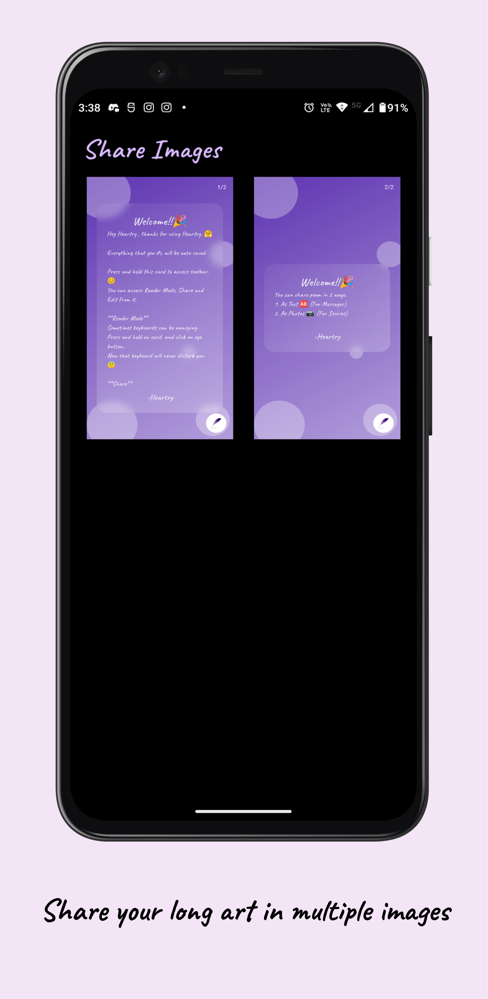
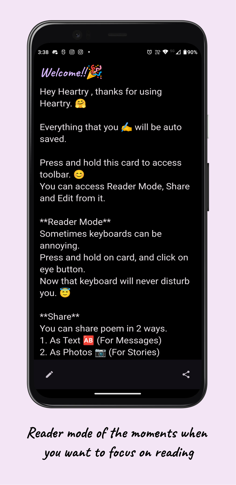

    

<h1 align='center'>Heartry</h1>
<h4 align='center'>Heart + Poetry</h4>

### Features

- NO ads
- Privacy focused
- Beautiful UI and animations
- Works seamlessly
- Get your art as image instantly
- An easy way to add your poems to stories

### Screenshots

<table>
    <tr>
        <td>
            
        </td>
        <td>
            
        </td>
        <td>
            
        </td>
        <td>
            
        </td>
        <td>
            
        </td>
    </tr>
    <tr>
        <td>
            
        </td>
        <td>
            
        </td>
        <td>
            
        </td>
        <td>
            
        </td>
    </tr>
</table>

 

### Contributions

- Contributions are always welcomed.
- Please check [CONTRIBUTING.md](https://github.com/SirusCodes/Heartry/blob/main/CONTRIBUTING.md)

